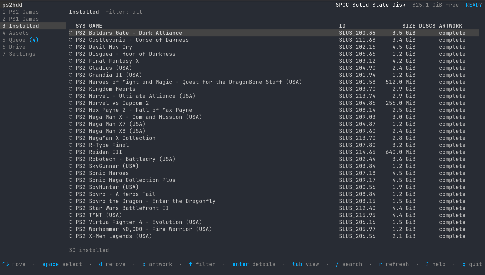
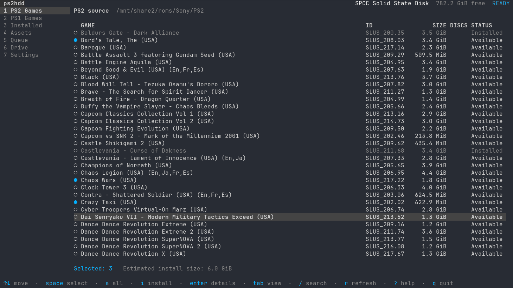
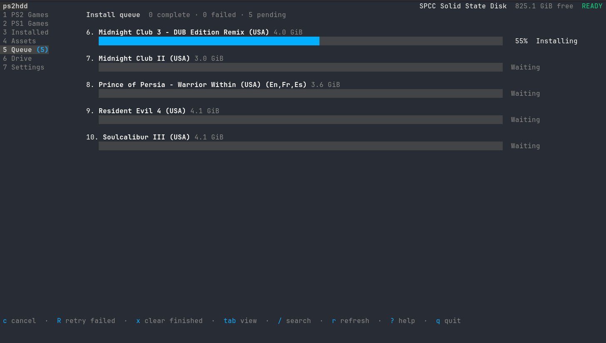
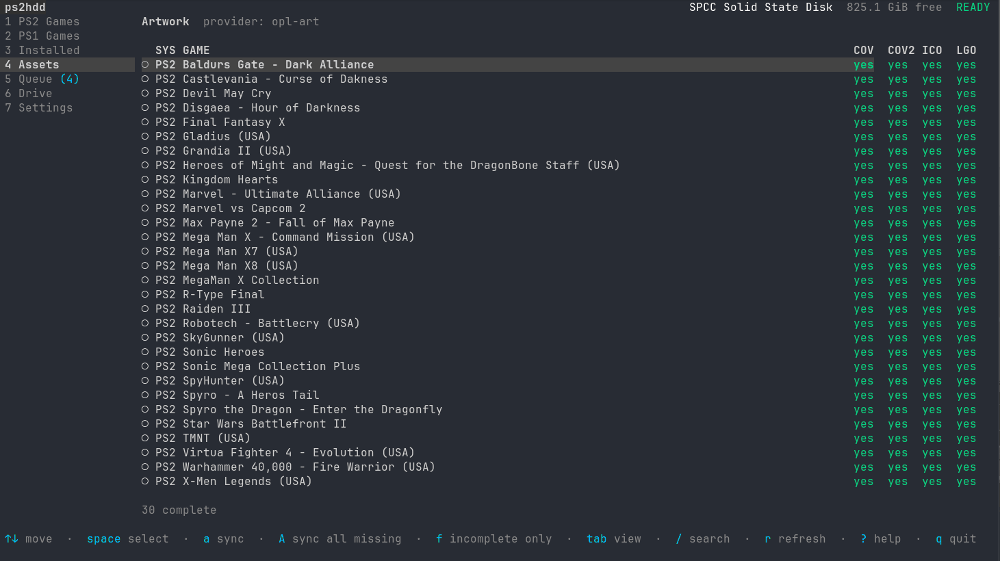
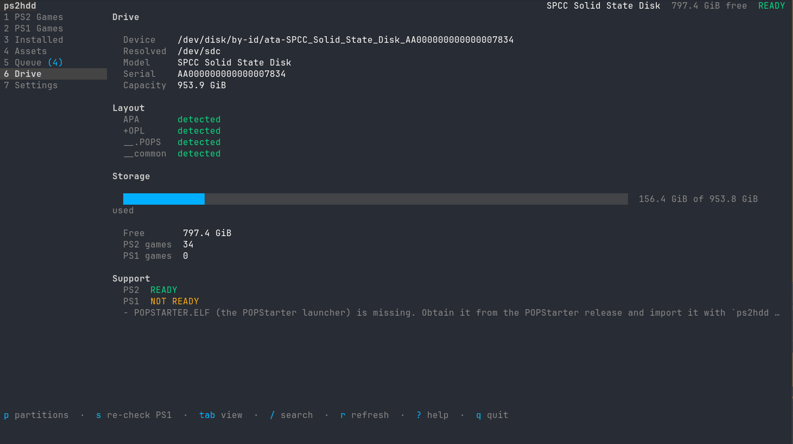
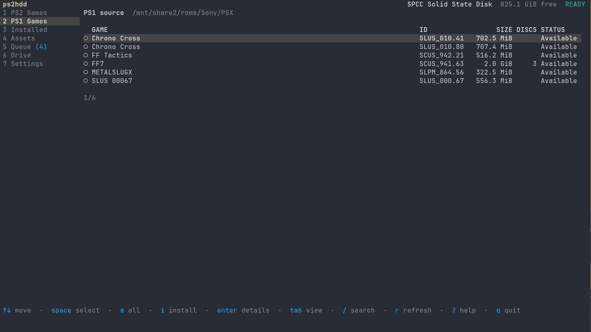
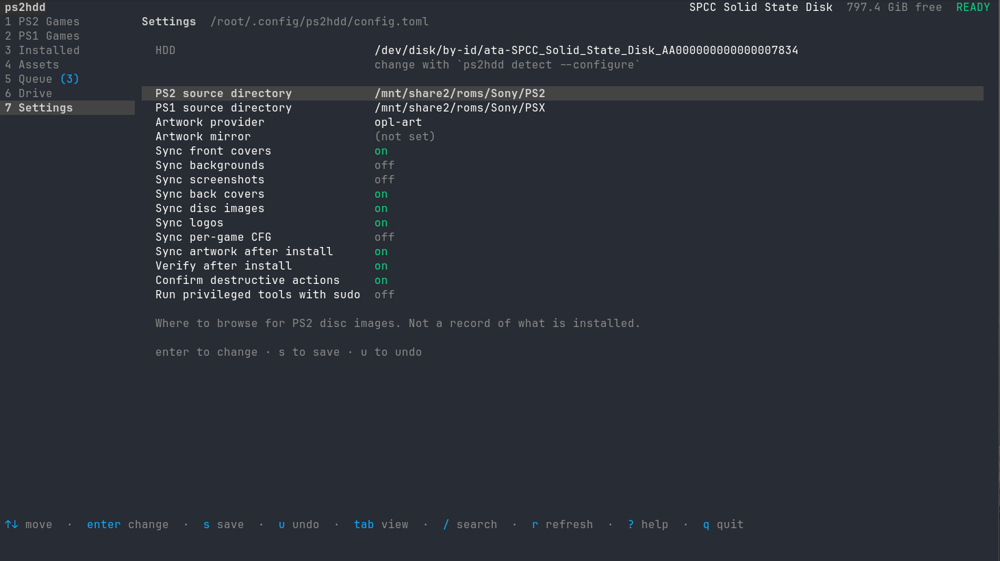

# ps2hdd

A Linux-native manager for PlayStation 1 and PlayStation 2 hard drives.

Point it at the SATA disk out of your PS2 and manage the whole library from a
terminal: browse your ISOs and BIN/CUE rips, install them, remove them, and
fill in the artwork Open PS2 Loader shows on the console. No Windows, no Wine,
no OPL Manager, no WinHIIP, and no staging directory full of games you already
have somewhere else.



## What it manages

A PlayStation 2 internal hard drive as FreeHDBoot leaves it:

- an **APA** partition table
- PS2 games as **HDLoader** partitions
- PS1 games as **POPS** virtual CDs in `__.POPS`, launched by **POPStarter**
- artwork and per-game settings in **`+OPL`**, read by **Open PS2 Loader**

## Screens

Seven views, one keystroke apart. `tab` cycles them; the digits jump straight to
one.

**Browse a source directory and pick what you want.** Selection is multi-select
and the estimate is computed from the images themselves, so it is what will
actually land on the disk. Titles already installed stay visible and dimmed
rather than disappearing.



**Then watch the queue run.** A failure stops that title, not the run.



**Artwork, per slot, per game.** Front covers, back covers, disc images and
logos, fetched at the exact dimensions OPL expects. A slot the configured
provider cannot supply is reported separately from one that is merely missing,
because no amount of syncing will fill it.



**The drive, as it actually is.** Partition layout, space and PS1 readiness,
read natively from the APA table with no external tools involved.



**PS1 rips are grouped into titles**, so a three-disc release is one entry
rather than three. Source directories are browsing locations, never a record of
what is installed — only the HDD decides that.



**Every setting is editable in place**, written back to the same TOML file the
CLI reads.



## Try it without a PS2 HDD

```sh
go build ./cmd/ps2hdd
./ps2hdd --demo
```

`--demo` builds a synthetic APA disk image and a synthetic source library under
your cache directory and runs the real program against them — the same install,
remove, artwork and PS1 code paths, with only the block device and the two
external tools replaced. It is how the test suite works, and it is a fair way
to see what the program does before pointing it at a real drive.

Every CLI command works in demo mode too:

```sh
./ps2hdd --demo list
./ps2hdd --demo install ~/.cache/ps2hdd/demo/sources/ps2/"Gran Turismo 4.iso"
./ps2hdd --demo doctor
```

## Dependencies

Only writing needs external tools. Reading the library, the partition table and
the drive status is done natively, so a missing `hdl_dump` leaves you with a
working read-only browser rather than a broken program.

| Tool | Needed for | Where |
|---|---|---|
| `lsblk` | finding disks | `util-linux`, already installed |
| `hdl_dump` | installing and removing PS2 games | [ps2homebrew/hdl-dump](https://github.com/ps2homebrew/hdl-dump) |
| `pfsfuse` | reaching `+OPL` and `__.POPS` | [ps2homebrew/pfsshell](https://github.com/ps2homebrew/pfsshell) |
| `fusermount3` | releasing those mounts | `fuse3` |

`ps2hdd doctor` tells you which are missing and what each one is for.
**`docs/dependencies.md` has per-distribution install instructions**, including
two things that are easy to get wrong: `pfsfuse` is off by default in the
pfsshell build, and it wants FUSE 2 rather than FUSE 3.

BIN/CUE to VCD conversion is built in; no `cue2pops` needed.

## Install

A static binary, no runtime dependencies:

```sh
base=https://github.com/casmith/ps2hdd/releases/latest/download
curl -fLO --retry 3 $base/ps2hdd-linux-amd64
curl -fLO --retry 3 $base/SHA256SUMS
sha256sum -c --ignore-missing SHA256SUMS
sudo install -m0755 ps2hdd-linux-amd64 /usr/local/bin/ps2hdd
```

Use `ps2hdd-linux-arm64` on aarch64.

`-f` is not decoration. Without it curl writes the server's error page into the
file, and `install` will happily mark nine bytes of `Not Found` executable; the
first sign of trouble is a shell trying to run it. With `-f` a failed download
leaves no file behind and says so.

`/usr/local/bin` is not incidental. ps2hdd needs raw block device access, so it
is normally run under `sudo`, and sudo's `secure_path` includes neither
`~/.local/bin` nor Homebrew — a binary in either is invisible to exactly the
runs that need it.

Or from source, with Go 1.25 or later as declared in `go.mod`:

```sh
go build -o ps2hdd ./cmd/ps2hdd
sudo install -m 0755 ps2hdd /usr/local/bin/ps2hdd
```

A source build reports its version as `dev` unless you pass one:
`-ldflags "-X main.version=$(git describe --tags --always)"`. Release binaries
carry the tag they were built from, which `ps2hdd --version` prints.

## First run

```sh
# 1. Find the drive. Read-only; it will not touch anything.
ps2hdd detect

# 2. Save it. Only a stable /dev/disk/by-id path is ever written.
ps2hdd detect --configure

# 3. Say where your games live.
ps2hdd config set sources.ps2 /mnt/nas/games/ps2
ps2hdd config set sources.ps1 /mnt/nas/games/psx

# 4. Check everything.
ps2hdd doctor

# 5. Open the interface.
ps2hdd
```

Raw block devices are root-owned. `docs/safety.md` has a udev rule that grants
access to one specific drive, which is better than running any of this as root.

## Using the interface

`ps2hdd` with no arguments opens it. Seven views, `tab` or `1`–`7` between
them:

| View | What it does |
|---|---|
| **PS2 Games** | browse the PS2 source directory, select with `space`, install with `i` |
| **PS1 Games** | the same for PS1, with multi-disc titles shown as one game |
| **Installed** | everything on the HDD; `d` removes, `a` fetches artwork, `f` filters |
| **Assets** | artwork completeness per game; `a` syncs the selection, `A` syncs everything missing |
| **Queue** | bulk installs, with progress; leave the view and work continues |
| **Drive** | capacity, partitions, free space, PS1 readiness |
| **Settings** | source directories, artwork options, confirmations — no TOML editing |

`/` searches, `r` refreshes, `?` lists every key, `q` quits.

The interface stays responsive while scans, downloads, conversions and installs
run. Raw-HDD writes are serialised, because `hdl_dump` makes no promise about
concurrent writers to one disk.

## Using the CLI

Everything the interface does is scriptable.

```sh
ps2hdd doctor                       # check the setup
ps2hdd detect [--configure]         # find a drive (read-only)
ps2hdd status [--partitions]        # drive overview

ps2hdd source scan [--rescan]       # scan the source directories
ps2hdd source list [--ps1|--ps2]

ps2hdd list                         # the unified library
ps2hdd list --ps1 --json
ps2hdd list --missing-art
ps2hdd info SLUS_209.46
ps2hdd info ~/Downloads/game.iso    # works with no HDD at all

ps2hdd install ~/Downloads/sotc.iso
ps2hdd install "MGS (Disc 1).cue" "MGS (Disc 2).cue" --title "Metal Gear Solid"
ps2hdd install --from-source "God Hand"
ps2hdd remove SLUS_209.46
ps2hdd remove "Shadow of the Colossus" --purge-assets

ps2hdd mount +OPL                   # prints the mountpoint; stays after exit
ps2hdd unmount +OPL

ps2hdd art status [--missing]
ps2hdd art sync --all
ps2hdd assets sync SLUS_209.46 --overwrite
ps2hdd assets clean
ps2hdd database update

ps2hdd setup ps1 [--create-pops 20G] [--import ~/pops-files]
ps2hdd config show
ps2hdd config set sources.ps2 /mnt/nas/games/ps2
```

Global flags: `--device`, `--dry-run`, `--json`, `--verbose`, `--debug`,
`--yes`, `--demo`, `--no-color`, `--config`.

`--dry-run` prints the exact external command it would run, so you can see
precisely what is about to happen to the disk.

`--json` works on `status`, `list`, `info`, `detect`, `doctor`, `source list`,
`art status`, `assets status` and `setup ps1`.

## Source directories

```toml
[sources]
ps2 = "/mnt/nas/games/ps2"
ps1 = "/mnt/nas/games/psx"
```

These are places to browse, not a record of what is installed. Only the HDD
decides that.

PS2 titles are identified from `SYSTEM.CNF` inside the image, never from the
filename. PS1 rips are read the same way; `.cue` files take precedence over the
`.bin` they name, and a `.bin` referenced by a `.cue` is never listed
separately.

Multi-disc PS1 titles are grouped automatically, from either common layout:

```
Final Fantasy VII/            psx/
├── Disc 1.cue                ├── Metal Gear Solid (Disc 1).cue
├── Disc 1.bin                ├── Metal Gear Solid (Disc 1).bin
├── Disc 2.cue                ├── Metal Gear Solid (Disc 2).cue
└── Disc 2.bin                └── Metal Gear Solid (Disc 2).bin
```

Scan results are cached under `~/.cache/ps2hdd/`, keyed on path, size and
modification time, so reopening the interface does not reread every image.

You never have to put a game in a source directory: `ps2hdd install
/any/path/game.iso` works.

## Artwork

Artwork goes in `+OPL/ART` as `<serial>_<TYPE>.png` — the naming current OPL
actually looks for. `docs/compatibility.md` has the full table with sizes.

The default provider fetches front covers from the community databases PCSX2
and DuckStation use. They hold covers only; every other slot is reported as
unavailable rather than filled with a substitute. For the rest, point
`assets.mirror` at a local collection (an OPL Manager art dump, or a copy of a
working `+OPL/ART`, both work unchanged) or add URL templates for another
database. A mirror is tried before the network automatically.

**ps2hdd never overwrites artwork you already have** unless you pass
`--overwrite`. Hand-picked covers are not ours to replace.

## PlayStation 1 support

PS1 games run through POPStarter, which needs two files from Sony:

```
hdd0:__common/POPS/POPS.ELF
hdd0:__common/POPS/IOPRP252.IMG
```

**ps2hdd does not and will not ship them.** It detects whether they are there,
says so plainly, and imports copies you supply:

```sh
ps2hdd setup ps1                       # what is missing
ps2hdd setup ps1 --create-pops 20G     # create the partition the VCDs live in
ps2hdd setup ps1 --import ~/pops-files # copy in your own runtime files
```

Only files matching the documented runtime are copied; anything else in that
directory is listed and left alone.

**A VCD on the disk is not yet a game you can start.** Open PS2 Loader has no
PS1 support at all — there is no reference to POPS or `.VCD` anywhere in its
source — so what puts a title in a menu is a copy of `POPSTARTER.ELF` renamed
after the VCD, in its own directory under `+OPL/APPS` with a `title.cfg` beside
it. `install` writes all three, `doctor` reports any title that lacks them, and

```sh
ps2hdd setup ps1 --launchers           # write the launchers that are missing
```

fills in titles installed before this existed, or by another tool. Titles that
already have one are left alone. See [docs/compatibility.md](docs/compatibility.md)
for the exact rules OPL applies, all of which fail silently.

`--create-pops` sizes the partition for the library you intend to keep — a VCD
is a raw 2352-bytes-per-sector image, so budget around 750 MB per disc, and err
large, because growing it afterwards needs a PS2-side tool. The allocation is
done by `pfsshell` rather than by ps2hdd, for the same reason installs go
through `hdl_dump`: the reference implementation decides how APA space is laid
out. ps2hdd confirms the result by reading the partition table back, because
`pfsshell` is a shell and a failed `mkpart` still exits 0.

### Planning a bulk install

```sh
ps2hdd install --all --dry-run          # everything not yet installed
ps2hdd install --all --ps1 --dry-run    # just the PlayStation 1 library
```

This answers the question a stack of single dry runs cannot. Checking each
title against the drive's current free space reports that all five hundred fit,
because individually all five hundred do. `--all` consumes the space as it
walks the list, so what it tells you is **where the run stops**.

PS2 titles are placed by replaying hdl_dump's allocator against the drive's
real chunk map, so partition overhead and fragmentation are part of the answer
rather than an approximation of it. PS1 titles are VCDs inside `__.POPS`, an
already-allocated partition, so they are counted against the room left in it —
a different pool that runs out separately. The plan names both.

Run it before you size `__.POPS`, since growing that partition afterwards needs
a PS2-side tool. With no drive attached the sizes are still worth having; the
verdict then reads `not measured` rather than inventing one.

### Choosing a subset

`--from-list` plans the titles named in a file instead of everything:

```sh
ps2hdd install --from-list wanted.txt --dry-run
```

```
# what I actually want
Gran Turismo 4
SCUS_974.72                       # by serial, with a note
Ace Combat 04 - Shattered Skies (USA).7z
/mnt/roms/Ico (USA).7z
```

One title, serial, filename or image path per line; blank lines are skipped and
`#` starts a comment, so the list can carry notes and live in version control.

A **directory listing works as it stands** — `ls /mnt/roms/ps2 > wanted.txt` —
which is the obvious way to build one. A bare filename matches no title (the
extension is not part of one) and looks like no path (it names no directory),
so it is matched against the file each entry was read from, with or without the
extension.
**Every line must resolve** — a typo that quietly dropped one game out of two
hundred would be noticed months later by its absence — and unresolved lines are
reported together, by line number, rather than one run at a time. A title
already on the drive is skipped rather than counted against the free space.

A title containing a `#` is cut short by the comment rule; name that one by its
serial.

**A directory of symbolic links is not an alternative.** The source scanner
reads regular files only, so links are skipped without comment.

### Running it

Drop `--dry-run` and the same plan is installed:

```sh
ps2hdd install --all
ps2hdd install --from-list wanted.txt --ps1
```

One confirmation for the run, not one per title — a batch that asked five
hundred times would be answered by holding down a key, which is not consent.

**A failure stops that title and nothing else.** Across several hundred titles
one bad archive is close to certain, and aborting the run for it would throw
away the hours already spent and every title after. Failures are collected,
named at the end, and the command exits non-zero.

Titles the plan said would not fit are **named rather than attempted**, so the
run does what the plan promised instead of rediscovering it one refusal at a
time.

**There is no resume state.** Run the same command again and titles already on
the drive are skipped — the same answer a saved position would have given, and
one that cannot go stale.

### Removing in bulk

The same list takes them off again:

```sh
ps2hdd remove --from-list gone.txt --dry-run
ps2hdd remove --from-list gone.txt
```

Entries resolve the same way — a title, a serial, a partition name, or the
filename of the archive the game came from — so a directory listing works in
both directions. An installed title has no source path of its own, so a
filename is matched through the catalog, which is what pairs a game on the
drive with the archive it came from.

The dry run shows what would go and how much it frees. Confirmation is once for
the run.

**Nothing is removed if any line fails to resolve.** On a delete list a typo
costs more than on an install list: the wrong match takes a game off the drive.
A line naming a title that is simply not installed is a different thing — it is
counted and skipped, because deleting what is already gone is a no-op.

**The next title is unpacked while the current one is written.** The two halves
of an archived install use different machines — LZMA on one core plus a write
to scratch, then hdl_dump pushing raw sectors at the drive — and run in
sequence they simply add up. On a measured library the extraction is the larger
half, around seventy seconds for a DVD-sized title, during which the drive is
idle and fifteen of sixteen cores are too, because a solid LZMA stream cannot
be split.

Only extraction overlaps. Injection stays strictly serial: hdl_dump rewrites
the APA partition table, and two at once is not something it survives.

`install.prefetch` is the depth, default 2 — the title being installed and the
one after it. It is a **disk budget** before it is a concurrency setting: each
unpacked title is up to 4.7 GB in the scratch directory, so raising it costs
that much space per extra slot and buys nothing once the writer never waits.
Set it to 1 to turn the pipeline off.

The run reports how many titles arrived already unpacked, which is the only
evidence it did anything.

### Compressed sources

A PS2 library kept as `.7z`, `.zip` or `.rar` archives is read in place. One
archive holding one disc image is the expected shape; anything else is reported
rather than guessed at.

Scanning does not unpack anything. Only the first 16 MiB of each image is
decompressed, which covers the volume descriptor and the root directory — the
serial, the title, the true image size and the media type all come from there.
A cold scan of 513 archives takes about 25 seconds, and the result is cached.

`SYSTEM.CNF` is still preferred for the serial when it can be reached, but on a
real library it often sits gigabytes into the image, well past any bounded
read. The fallback is the boot ELF in the root directory, which every PS2 disc
names after its serial (`SLUS_202.16;1`). That fallback applies only to a
partial read: given the whole image, ps2hdd has no excuse to guess.

A CD-based title ripped raw comes out with its cuesheet. `hdl_dump` cannot read
a bare MODE2/2352 `.bin` — its input layer answers `Input or output is
unsupported` — but it reads the CDRWIN sheet naming that `.bin` perfectly well,
because the sheet is what records the sector layout. So the sheet is extracted
alongside and is what gets handed over. The same applies to a loose `.bin` with
a `.cue` beside it.

Installing does unpack, because `hdl_dump` seeks around the image and cannot be
fed a stream. The copy goes to `install.scratch_dir` (default
`~/.cache/ps2hdd/scratch`, deliberately not `/tmp`, which is often tmpfs), is
checked for free space first, and is deleted afterwards whatever the outcome.

Needs `7z` on PATH; `ps2hdd doctor` says whether it is there.

**The scratch copy is removed after every install**, successful or not: it
duplicates data that still exists in the archive, and gigabytes of it. The same
directory holds PS1 conversion staging, so a VCD is built on disk rather than
in `/tmp`, which is tmpfs on most distributions and would otherwise put a whole
disc in RAM.

A deferred cleanup does not run when the process is killed, though — an OOM
kill, a power cut — so a run that dies partway leaves its scratch behind. The
next install reclaims anything more than a day old, and `ps2hdd doctor` reports
it in the meantime. Age is the test rather than bookkeeping: a directory in use
is minutes old, installs never run concurrently, and nothing about that can go
stale.

Installing a PS1 game converts the rip to POPS's VCD format — built in, and
verified byte-for-byte against `cue2pops` v2.0 by the test suite — and copies
it into `__.POPS`, then writes the POPStarter launcher that makes it appear in
OPL. Multi-disc titles get a `DISCS.TXT` so POPStarter can swap discs in game,
a `VMCDIR.TXT` so every disc shares one memory card, and one launcher pointing
at disc 1.

`--widescreen` turns on POPStarter's GTE widescreen hack for a PS1 title. It
corrects 3D geometry; HUDs, fonts and 2D art stay stretched, and some games do
not run with it, so it is opt-in. `install.widescreen` sets the default.

The rip must be `MODE2/2352`. 2048-byte MODE1 images are refused with an
explanation rather than converted into something that would not boot.

**A split dump does not need merging first.** Redump-style rips keep every
track in its own BIN, which POPS cannot read; ps2hdd joins them as it converts,
concatenating the tracks in cuesheet order and rewriting each timecode to its
absolute position. Nothing is written to disk twice — the tracks are streamed
into the VCD in one pass — and the result is byte-for-byte what converting an
already merged rip produces, which the test suite asserts directly. On one real
library that took the available titles from 850 to 1,448.

The two-second pregap before an audio track is real data inside that track's
file, which is what makes plain concatenation correct; a track that is not a
whole number of 2352-byte sectors is a truncated rip and is refused, because
joining it would silently shift every track after it.

## Raw disk safety

The tool is deliberately paranoid. It:

- refuses to persist `/dev/sdX`, which is reassigned between boots
- revalidates the device immediately before every write
- refuses any disk backing `/`, `/boot`, or any mounted Linux filesystem, with
  no override flag
- refuses when the identity is ambiguous
- never formats, initialises, resizes or repairs anything
- releases every mount it made on exit, including on Ctrl-C, and never
  unmounts one you made

A refusal looks like this and exits 3:

```
REFUSING OPERATION

Device:
  /dev/disk/by-id/nvme-eui.e8238fa6bf53...

Reason:
  /dev/nvme1n1 backs the root filesystem.
  ps2hdd will never operate on the running system's disk.

No disk modifications were made.
```

Read `docs/safety.md` before your first write. It covers the full check list,
the udev rule, and how to rehearse against a disk image.

## Files

```
~/.config/ps2hdd/config.toml     configuration
~/.cache/ps2hdd/                 scan cache, artwork cache, demo environment
~/.local/state/ps2hdd/ps2hdd.log log
$XDG_RUNTIME_DIR/ps2hdd/         mountpoints, released on exit
```

`config.example.toml` is a commented starting point. The cache is disposable.

## Troubleshooting

**"permission denied reading /dev/sdb"** — raw devices are root-owned. Install
the udev rule from `docs/safety.md`, or set `tools.sudo = true` after adding a
narrow sudoers rule.

**`detect` finds nothing** — check the drive is attached and APA-formatted.
ps2hdd will not format it for you. `ps2hdd detect --all` shows every disk and
why each was skipped.

**"pfsfuse could not find partition +OPL"** — some drives use a different OPL
partition name. `ps2hdd status --partitions` lists what is actually there.

**Artwork does not appear on the console** — check the filenames in
`+OPL/ART`. OPL wants `SLUS_209.46_COV.png`; older guides describe `BG_00` and
`SCR_00`, which current OPL does not read.

**Some art appears and some does not** — check the dimensions, not the
filenames. OPL silently refuses any texture over 1,474,560 bytes, so an
oversized cover is dropped with no message while a 64x64 disc from the same
sync renders fine. `file +OPL/ART/*_COV.png` should say `140 x 200`. ps2hdd
scales art to the slot on install, so this means the files predate that or came
from elsewhere; `ps2hdd art sync --all --overwrite` replaces them. See
`docs/compatibility.md`.

**No artwork at all, from a console that used to show it** — OPL gates covers
behind Display Settings → Enable Cover Art, and the device holding the ART must
be enabled there too. Rule this out before suspecting the files: it is quick,
and it is not something ps2hdd can see.

**A game will not boot after installing** — check `ps2hdd info <serial>` shows
the right media type. A DVD image installed as a CD will not boot.

**Something went wrong and you want detail** — `~/.local/state/ps2hdd/ps2hdd.log`
records device resolution, every safety check, every external command, mount
lifecycle and install stages. `--debug` mirrors it to stderr.

## Development

```sh
go test ./...          # no hardware, no external tools needed
go vet ./...
gofmt -l .
go build ./cmd/ps2hdd
```

### Cutting a release

Releases are proposed by [release-please](https://github.com/googleapis/release-please)
and cut by merging its pull request. Nothing is tagged by hand.

Every push to `main` is read as conventional commits. `feat:` bumps the minor
version, `fix:` the patch; anything marked `BREAKING CHANGE:` bumps the minor
too while the project is below 1.0, because a major bump before there is a
stable interface says nothing. release-please keeps one PR open showing the
version it would publish and the changelog it would write, and rewrites it as
more commits land. Merging it tags, creates the release, and updates
`CHANGELOG.md`.

`.github/workflows/release.yml` then re-runs gofmt, vet and the race suite on
that commit, cross-compiles amd64 and arm64, checks that the binary reports the
tag it was built from, writes `SHA256SUMS` and attaches everything.

It is called directly rather than waiting on the tag, because **a tag pushed
with `GITHUB_TOKEN` does not trigger workflows** — that is what stops a workflow
setting itself off forever. A hand-pushed `v*` tag still works and takes the
same path, creating the release itself, which is what keeps an out-of-band
release possible.

**A release is visible for a minute or two before its binaries are on it.** That
window is why the install instructions use `curl -fLO`: without `-f`, curl writes
the 404 body to the file and `install` marks nine bytes of `Not Found`
executable.

Closing the window by publishing as a draft was tried and reverted. A draft
release has no git tag — GitHub creates the tag when the release is published —
and release-please identifies its own last release by tag. With none to find it
fell back to the manifest for the version but had no commit baseline, so it
reconsidered all 82 commits, found `feat:` among them, and proposed a minor bump
whose changelog was the entire history. Every merge did it again.

The window is a bad download that now fails loudly. The draft was a broken
release process. `-f` was always the fix that mattered.

The version reaches the binary through `-X main.version`, so it is only ever as
good as `git describe` — with no tags at all it degrades to a bare commit hash,
silently. The workflow asserts `--version` contains the tag rather than trusting
that, because a rename of `main.version` would otherwise leave every release
reporting `dev` with nothing failing.

The suite runs against synthetic APA images (`internal/apa/apasynth`),
synthetic ISO 9660 and MODE2/2352 discs (`internal/iso9660/isosynth`),
captured output from the real external tools (`testdata/`), and a full
synthetic environment (`internal/demo`) that the service-layer and interface
tests drive end to end.

Hardware tests are separate and read-only:

```sh
PS2HDD_TEST_DEVICE=/dev/disk/by-id/ata-YOUR_DRIVE go test -tags=hardware ./internal/drive/
```

The native APA reader is also checked against `hdl_dump`, which is the single
most valuable verification in the project — everything else stands on that read
path. `ps2hdd doctor` does it on every run, whenever `hdl_dump` is installed and
can read the drive:

```sh
sudo ps2hdd doctor        # see the "Reader cross-check" block
```

A disagreement is reported as a problem and doctor exits non-zero. `not checked`
means the comparison could not run — usually no `hdl_dump`, or no root — and
must not be read as a pass.

For a per-game report, a drive you have not configured, or a disk image behind a
loop device:

```sh
sudo scripts/crosscheck-hdl.sh              # the configured drive
sudo scripts/crosscheck-hdl.sh /dev/loop1   # an image; the script explains how
```

**No test in this repository writes to a block device.** Write coverage is the
manual checklist in `docs/hardware-validation.md`.

### Layout

```
cmd/ps2hdd/          entry point
internal/model/      shared types, no I/O
internal/config/     TOML configuration, XDG paths
internal/apa/        APA and HDLoader parsing (read-only, native)
internal/iso9660/    just enough ISO 9660 to read SYSTEM.CNF
internal/drive/      detection, identity, safety, mounts
internal/external/   every exec.Command in the project
internal/platform/   PS2 and PS1 inspection, VCD conversion, POPStarter
internal/catalog/    source scanning, installed reading, reconciliation
internal/asset/      artwork inventory, providers, sync
internal/app/        the service layer both front ends use
internal/cli/        Cobra commands
internal/tui/        Bubble Tea interface
internal/demo/       synthetic environment for --demo and tests
```

Core disk logic lives in the service layer, never in a Cobra `RunE` or a Bubble
Tea `Update`. Every `exec.Command` is in `internal/external`.

### Further reading

- `docs/dependencies.md` — installing `hdl_dump` and `pfsfuse`, per distribution
- `docs/compatibility.md` — every upstream fact this depends on, with sources
- `docs/safety.md` — the safety model and how to grant access properly
- `docs/hardware-validation.md` — the manual checklist

## Not supported

Reimplementing APA, PFS or HDLoader; formatting or resizing anything;
automatic partition repair; cheats; Windows.

## Licence

Apache-2.0. See `LICENSE`.

ps2hdd is not affiliated with Sony Interactive Entertainment. It bundles no
Sony code and no game data.
